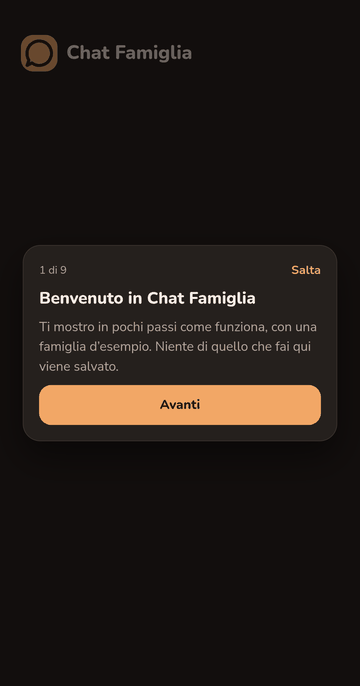
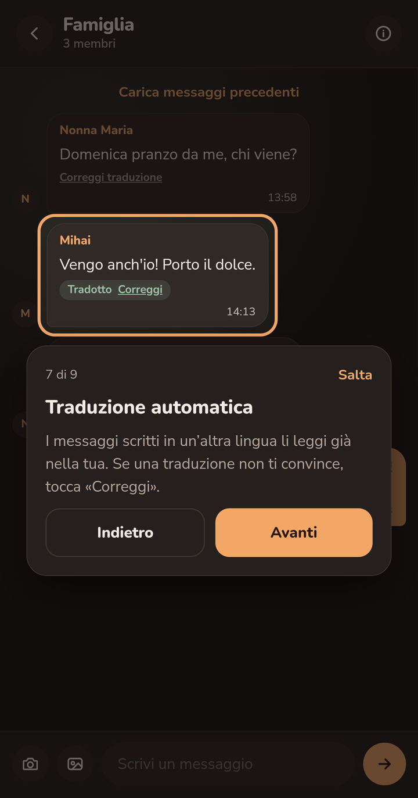

English | [Italiano](README.it.md)

# FamilyChat

A family chat where everyone writes in their own language and reads in theirs: messages are translated automatically into the language of the reader's phone. Built for a family spread across countries (Italian, Romanian and more).

<p align="center">
  
  
</p>

**[Try the app](https://familychat-v2.onrender.com)**: on the login page, tap «Come funziona? Guarda il tour» for a guided tour, or «Prova la demo» to explore with sample data. No account needed.

## Features

- **Rooms and invites.** Chats are grouped into rooms. Members invite people with a single-use code, which the new person enters to join («Unisciti»).
- **Realtime chat with photos.** Text and up to 10 photos per message, compressed on the device (HEIC from iPhone included). Full-screen viewer with download. Unread counters per room.
- **Automatic translation.** Each message is shown in the reader's language, marked «Tradotto». Anyone can fix a translation with «Correggi»: the correction is shared with the whole family. A separate «Traduttore» page translates free text.
- **Push notifications.** Web Push for new messages, with per-room mute.
- **Guided tour and demo, no account needed.** A step-by-step tour on first launch and a free demo («Prova la demo»), both running on sample data kept in memory.
- **Installable PWA.** An install button (Chrome, Edge, Samsung Internet), instructions on iPhone, and a bar that offers to reload when a new version is deployed.
- **Two accounts on one device**, light and dark theme.
- **Languages.** The interface is in Italian. The welcome guide, the tour, the demo and the install/update prompts are in Italian, Romanian, English and French.
- **Retention.** Messages older than 30 days are deleted automatically, together with their photos.

## Stack and technical choices

- **React 19 + TypeScript + Vite.** Plain client-side app, no server of its own.
- **React Router 7.** Real URLs (`/rooms/<id>`): the service worker reads them to skip notifications for a room that is already open.
- **TanStack React Query.** Server state and cache. Realtime events are merged into the cache by id, so a message never shows up twice or disappears.
- **zustand.** Small client stores: session, accounts on the device, tour/demo mode, install prompt.
- **Code organised by feature** (`src/features/*`): each feature keeps its pages, hooks and texts together.
- **Supabase.**
  - Auth: email and password, password reset.
  - Postgres with Row Level Security on every table: users only see their own rooms.
  - Storage: private bucket for chat photos (signed URLs), public bucket for profile photos.
  - Realtime on messages.
  - `pg_cron`: 30-day retention and a daily cleanup of orphan photos.
  - Edge Functions: `translate-message`, `send-push`, `cleanup-orphan-photos`.
- **Translation (`translate-message`).**
  - A chain of services: Azure → Google → Mistral. If one fails or is not configured, the next one takes over.
  - A shared translation memory in the database: the same text is never translated twice, and manual corrections win.
  - A monthly character counter keeps usage within the free limits; a service that runs out is skipped until the next month.
- **Tour and demo in a client-side sandbox.** All data access goes through one interface (`DataApi`). In the tour and the demo it is replaced by an in-memory version with sample data, rendering the same pages: no request reaches the database or any other service. While the sandbox is open, the real Supabase client throws if anything tries to use it.
- **Message order.** Messages are sorted by `created_at` with the `id` as tie-breaker, in the app and in the database. Loading older messages pages on the (`created_at`, `id`) pair, so two messages with the same timestamp are never skipped or duplicated.
- **PWA.**
  - `manifest.json`.
  - A hand-written service worker, used only for push notifications (no offline cache).
  - The install button.
  - An update check: when the app returns to the foreground, at most every 10 minutes, it compares the main script of the deployed `index.html` with the running one.

## Running locally

Prerequisites:

- Node.js 22 (see `.node-version`)
- pnpm 11 (see `packageManager` in `package.json`)
- Docker Desktop, for the local Supabase stack (the Supabase CLI runs through `npx`)

Steps:

```bash
pnpm install

# Local Supabase: database, auth, storage, realtime, Edge Functions.
# Applies every migration in supabase/migrations.
npx supabase start

# Frontend variables: copy the template, then fill in the local
# API URL and anon key printed by "npx supabase status".
cp .env.example .env.local

pnpm dev
```

The app runs at http://localhost:5173.

Translation needs provider keys in `supabase/functions/.env` (template: `supabase/functions/.env.example`). Without them the rest of the app works; messages simply stay untranslated.

`supabase/seed.sql` is **for the local database only**. The push trigger and the photo-cleanup job point to the hosted Edge Functions, so on a local database the seed turns them off. It must never run on the hosted project.

To stop the local stack: `npx supabase stop`.

## Tests

```bash
pnpm test              # unit and component tests (Vitest)
pnpm test:watch        # same, in watch mode
pnpm exec playwright install   # first time only: downloads the test browsers
pnpm test:e2e:local    # end-to-end tests (Playwright) on the local Supabase stack
```

`pnpm test:e2e:local` creates three test accounts (`@local.test`) and a room on the local stack, then runs Playwright against it. It stops if Supabase is not local, or if another server is already running on port 5173. `pnpm test:e2e` runs the same tests against the project configured in `.env.local`.

What the tests check, among other things:

- no request reaches Supabase during the tour and the demo, from page load to the real sign-up;
- no message is lost or out of order with three people writing at once, or while realtime is still connecting;
- messages with the same timestamp keep the same order in the app and in the database, also across two pages;
- the tour steps, the sandbox, and the Supabase client blocked while the sandbox is open;
- the install button and the iPhone instructions, never shown in the tour or the demo;
- every text key exists in all four languages.

Linting: `pnpm lint` (oxlint).

## Repository structure

```
src/
  features/      one folder per feature: auth, chat, rooms, translator,
                 notifications, tutorial, tour, sandbox, install, update, theme
  lib/           Supabase client, data interface, image compression, helpers
  components/    shared components (tab bar, avatar, icons)
public/          manifest.json, service worker (sw.js), icons
supabase/
  migrations/    database schema, RLS policies, cron jobs
  functions/     Edge Functions: translate-message, send-push, cleanup-orphan-photos
  seed.sql       local database only (see above)
scripts/         e2e-local.mjs: end-to-end tests on the local stack
tests/e2e/       Playwright tests
```

## Status and next steps

Development is ongoing. Open items tracked in `PLAN.md`:

- test on real phones: safe areas, the installed app, camera and download, iPhone;
- test photo upload with a real HEIC file.

Ideas, not planned yet: sign-in with passkeys, a captcha on the auth forms.

<!-- TODO: hosting/deployment is not described in the repository. -->

## License

© 2026 M.E.T. All rights reserved.
The source is public so you can read it and see how the app is built. If you'd like to reuse any part of it, feel free to get in touch: mandras_eugen@yahoo.com.
